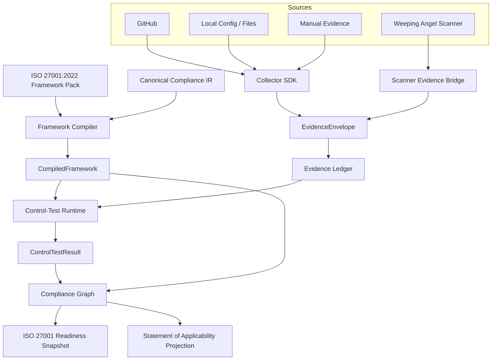
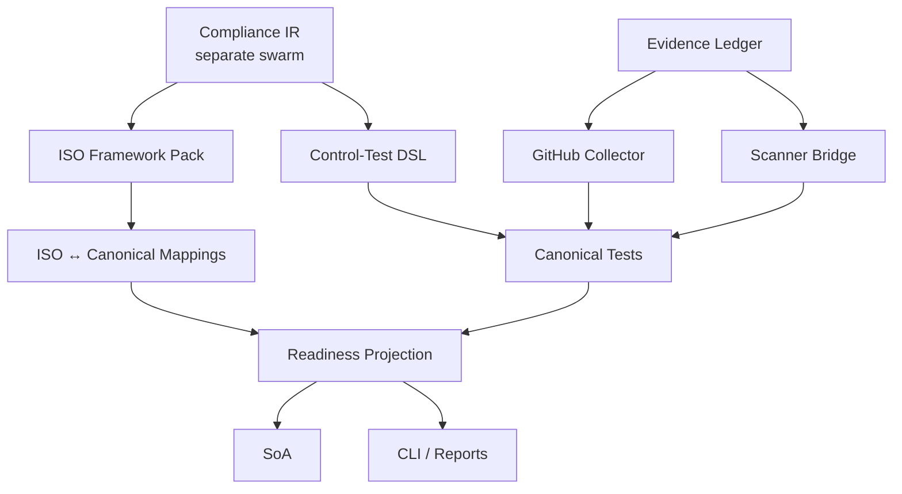

# SDD: ISO 27001 Automated Assurance MVP

| Field | Value |
| --- | --- |
| Status | **Implemented** (ISO 27001 vertical landed; baseline superseded) |
| Program | First real ISO 27001 assurance vertical |
| Dual-suite | Target GREEN (`sdd_iso27001_assurance_target`); baseline superseded (`sdd_iso27001_assurance_baseline`) |
| ADR | Accepted [`docs/adr/0002-iso-27001-assurance-vertical.md`](../adr/0002-iso-27001-assurance-vertical.md) |
| Later fact model | [ADR 0003 typed evidence](../adr/0003-typed-evidence-canonical-serialization.md) supersedes string-only observation facts; ISO envelope/ledger invariants stay |
| Spine (still law) | [`docs/specs/assurance-runtime-spine.md`](assurance-runtime-spine.md), [`docs/specs/assurance-runtime.md`](assurance-runtime.md), ADR 0001 |
| Concurrent IR | Separate program. This vertical **does not own** canonical Compliance IR. |
| Repository | `floris-xlx/weeping-angel` |
| Base branch | `main` |
| Planning baseline | `8c0f36ed873c51a21aa3e6d377d2fdbc4bb458d7` |
| Targeted IR revision | `assurance-ir/v1` as shipped on that SHA (`Control` / `Requirement` / `Mapping={direction,completeness}` / framework-owned `Assessment`) |
| Workspace verify | `cargo test --workspace --features demo`; `cargo fmt --all -- --check`; `cargo clippy --workspace --all-targets --all-features -- -D warnings` |

This document is the durable SSOT for the ISO 27001 **MVP** program. The vertical has landed: versioned structural pack, immutable ledger, `TestExpr` DSL, GitHub/local/manual collectors, readiness/SoA projections, and clap `assurance` family. Later work must not invent a competing IR, a GitHub→ISO shortcut, or certification claims.

**ISO remap remapping** (canonical catalog projection; pack-local slivers retired) is specified separately and **implemented**: [`docs/specs/iso-27001-canonical-remap.md`](iso-27001-canonical-remap.md) §13, [ADR](../adr/0003-iso27001-canonical-remap.md). Do **not** reuse `sdd_iso27001_assurance_{baseline,target}` for that slice.

---

## 1. Problem / user-visible goal

The six-crate Athena-shaped spine exists, but it cannot yet produce a useful ISO 27001 readiness assessment. Catalogs are empty stubs. The only collector is a deterministic fixture. Control tests mostly check evidence-type presence, freshness, and manual attestation. There is no evidence ledger, no framework pack, no GitHub/local/manual collection path, no SoA projection, and no `weeping-angel assurance` CLI.

Organizations that already run Weeping Angel scanners still need an **automated readiness/assurance** path for ISO 27001:2022. They do not need a certification authority.

**User-visible goal:** an end-to-end internal MVP:

```bash
weeping-angel assurance assess \
    --framework iso-27001 \
    --scope .
```

or the equivalent library invocation, which:

1. loads a real ISO 27001:2022 framework pack;
2. determines applicable requirements;
3. maps those requirements onto canonical Weeping Angel controls;
4. determines required evidence;
5. collects evidence from Weeping Angel scanners, GitHub, and local/manual sources;
6. stores immutable evidence;
7. runs deterministic, provider-blind control tests;
8. calculates per-control effectiveness;
9. projects results into ISO 27001 readiness;
10. produces readiness summary, per-requirement status, per-control status, evidence trace, missing-evidence list, automated/manual classification, and Statement-of-Applicability-oriented output;
11. can rerun the same assessment without duplicating identical evidence;
12. produces an immutable snapshot that can later be compared to another run.

This is **not** certification. Automated evaluation must never emit:

```text
ISO 27001 certified
ISO 27001 compliant
certification guaranteed
audit passed
```

Allowed language:

```text
ready
effective
ineffective
insufficient evidence
requires manual review
not applicable
assessment coverage
```

---

## 2. Compatibility note (IR revision this program targets)

**Pinned at planning time.** Do not start by adding framework data. Fetch latest `main`, inspect concurrent Compliance IR work if it has landed, then rebase/adapt.

| Surface on SHA `8c0f36ed…` | Location | Shape this program must consume |
| --- | --- | --- |
| Schema | `ASSURANCE_IR_SCHEMA` | `assurance-ir/v1` |
| `Control` | IR | `{ schemaVersion, id, title, description }` — no annex / SoA / ISO fields |
| `Requirement` | IR | `{ schemaVersion, id, frameworkId, frameworkVersion, title, description }` |
| `Mapping` | IR | `{ fromRequirement, toControl, direction, completeness }` on the planning SHA; landed extension on the **same** type: `relation` + `rationale` (not a second mapping type) |
| `EvidenceRequirement` | IR | `{ id, evidenceType }` |
| `PlannedControlTest` | IR | `{ id, controlId, kind, requiredEvidence, breakOn }` |
| `Assessment` | **framework crate** (not IR) | in-memory document compiled by `compile_framework` |
| `AssessmentDefinition` | **not present** | concurrent IR program may introduce it; rebase onto IR, do not fork |
| `MappingRelation` / rationale | landed on IR `Mapping` | `Equivalent` \| `Satisfies` \| `PartiallySatisfies` \| `Supports` \| `Related`; not a competing mapping document |
| `SubjectSelector` | **not present** | same rule |
| `ComplianceGraph` | IR `crosswalk` | requirement↔requirement edges; `equivalent` only for explicit full bidirectional mappings |
| Facade `AssessmentReport` | assurance | `{ assessmentId, profile, digest, results, evidenceCount }` |

Hard rule: do **not** redesign `Control`, `Requirement`, `Mapping`, `AssessmentDefinition`, `SubjectSelector`, applicability types, stable IDs, or mapping semantics unless compilation requires a tiny compatibility adjustment. If the concurrent IR implementation changes these surfaces, rebase onto it rather than introducing a competing definition.

Tiny allowed adjustments: type aliases (`Assessment` → `AssessmentDefinition`), extra optional fields the IR already added, or compile-error fixes after an IR rebase.

---

## 3. Current behavior (baseline on planning SHA)

Characterized against `8c0f36ed873c51a21aa3e6d377d2fdbc4bb458d7`. The baseline suite **must stay GREEN** on this stub spine until the target suite is GREEN.

### 3.1 Crate graph

Workspace members: `weeping-angel-assurance-ir`, `weeping-angel-framework`, `weeping-angel-evidence`, `weeping-angel-collector`, `weeping-angel-control-test`, `weeping-angel-assurance`. Root package is the scanner CLI.

Forbidden edges already enforced by ACT-003 / ACT-013:

- framework ↛ collector, control-test, reqwest, AWS/GitHub/Cloudflare SDKs
- collector ↛ framework / ISO / GDPR / SOC2 packages
- control-test ↛ collector / network clients
- IR ↛ any upper crate

`weeping-angel-framework` depends only on serde / serde_json / thiserror / IR.

### 3.2 Framework compile

`compile_framework(assessment, target)` runs the eight-stage pipeline (`normalize` → `resolve_applicability` → `validate_capabilities` → `resolve_control_mappings` → `resolve_evidence_requirements` → `construct_test_plan` → `construct_framework_projection` → `integrity_validation`).

- `stub_catalog(profile)` returns `[]` for every profile, including `Iso27001`.
- Applicability is identity: all assessment requirements are treated as applicable.
- Compile input is an in-memory `Assessment` supplied by the caller (or by the facade stub).
- There is **no** on-disk framework-pack loader, validator, or `FrameworkPackDigest`.
- There is **no** `frameworks/iso-27001/2022` tree.

### 3.3 Facade assess

`AssuranceEngine::builder().collector(…).framework(…).assess(scope)` compiles a **hard-coded stub assessment**:

- one requirement `canonical:stub-1`
- one control `canonical.source-control`
- one **partial** forward mapping
- one evidence requirement `ev.branch_protection` / type `branch_protection`
- empty `tests` (compiler synthesizes a presence test from the first control + evidence types)
- `AssessmentRequests` all false (SoA / applicability / attestation flags off)

`AssessmentReport` is `{ assessmentId, profile, digest, results, evidenceCount }`. No readiness snapshot, no SoA, no missing-evidence list, no automation classification.

### 3.4 Evidence

`EvidenceEnvelope` is `{ observation, provenance, digest }`. Observation facts **on this planning SHA** are `BTreeMap<String, String>`. Provenance is `{ collectorId, collectedAt, scope, asset }`. (Later: [ADR 0003](../adr/0003-typed-evidence-canonical-serialization.md) stores `BTreeMap<String, EvidenceValue>`; string `with_fact` remains.)

There is **no** persistent ledger, **no** artifact store, **no** collection-run identity, **no** `supersedes` / `validFrom` / `validUntil` / sensitivity / typed values.

`EvidenceSet` is an in-memory digest map (retry is idempotent by digest only).

Seal rejects credential-looking fact keys and compliance narratives (`iso 27001 compliant`, `gdpr compliant`, `soc 2 compliant`, `controltestresult`, …).

### 3.5 Collectors

`EvidenceCollector` is synchronous:

```text
fn collect(&self, scope: &CollectorScope) -> Result<Vec<EvidenceEnvelope>, CollectorError>
```

`CollectorDescriptor` is `{ id, version, evidenceTypes }`. **No** `frameworks` field. **No** capabilities / permissions / provider family.

The only implementation is `FixtureCollector` with a fixed `collectedAt` of `2026-08-18T12:00:00Z`. There is no GitHub collector, no local filesystem collector, and no manual evidence producer.

### 3.6 Control-test runtime

`evaluate(CompiledControlTest, EvidenceSet, AssessmentContext)` is provider-blind and network-free.

- Four-state `Effectiveness`: `Effective` | `Ineffective` | `InsufficientEvidence` | `Inconclusive`
- Semantics: first matching `breakOn` → Ineffective; manual without `manual_attestation` → InsufficientEvidence; stale attestation/required evidence → Inconclusive; missing required type → InsufficientEvidence; otherwise presence of required types → Effective
- No expression AST, no typed field predicates, no coverage thresholds, no count operators
- `ControlTestResult` is `{ testId, controlId, effectiveness, rationale }` (`deny_unknown_fields`)

### 3.7 Scanner bridge

`weeping-angel-assurance::bridge` projects `EngineHit` / `SemanticFinding` → `EvidenceObservation` of type `security_finding` with string facts (`rule_id`, `path`/`finding_id`, `category`). One-way. Does not rewrite `to_semantic_finding`. Absence of findings is not modeled as positive evidence.

### 3.8 CLI

`Commands` is exactly: `Scan`, `Finalize`, `ScanCode`, `ScanDiff`, `Workbench`, `Depcheck`, `Version`, `Completions`. **No** `Assurance` variant.

### 3.9 Existing suites that must remain green

- `sdd_assurance_runtime_target`: ACT-001…015, COL-001…006
- `sdd_assurance_runtime_baseline`: superseded / ignored
- scanner tests under `cargo test --workspace --features demo`

---

## 4. Desired behavior (after this program)

Preserve the spine separation:

```text
Compliance IR
Framework Compiler
Evidence
Collectors
Control-Test Runtime
Assurance Orchestrator
```

Hard data-flow rule:

```text
Provider → Evidence → Canonical Test → Canonical Control → Framework
```

Never:

```text
GitHub → ISO check
AWS → ISO check
Cloudflare → ISO check
```

### 4.1 Target architectural flow



### 4.2 Program ownership

**This program owns**

```text
ISO 27001 framework pack/content
framework-pack loader
catalog validation
evidence ledger
artifact references
collector runtime upgrades
GitHub collector
local collector
manual evidence producer
Control-Test expression AST/runtime
ISO readiness projection
SoA projection
assessment snapshotting
CLI wiring
end-to-end tests
documentation
```

**This program does not own**

```text
canonical Compliance IR redesign
existing scanner finding schema
SemanticFinding schema
security engine internals
general GRC SaaS application
vendor management
HRIS
MDM
Trust Center
questionnaires
auditor portal
full ISO 27007 audit engine
```

Do not have multiple swarms modifying the same canonical types. If a shared type is needed, define the interface first and assign one owner. Prefer IR ownership for IR types.

### 4.3 Swarm layout

| Swarm | Owns | Must not touch |
| --- | --- | --- |
| A | ISO 27001 framework pack + structural catalog | IR type redesign, collector SDKs |
| B | Evidence ledger + artifacts + collection runs | control effectiveness, framework catalogs |
| C | Control-Test DSL / typed values / evaluator | network, provider clients |
| D | GitHub collector + permissions + retry | ISO mappings, control tests |
| E | Scanner evidence taxonomy + bridge expansion | finding schema rewrite |
| F | Readiness + SoA projection | collector implementations |
| G | CLI + reports | compiler internals as public UX |
| H | Conformance / integration / regression | production type ownership |

Work that can start while IR is landing: ledger design, GitHub normalization fixtures, ISO **structural** catalog research, ISO→canonical mapping matrix, Control-Test DSL design, scanner evidence taxonomy, E2E fixture design.

Only code that depends directly on new IR fields should wait/rebase.

---

## 5. Phases (normative)

### Phase 0 — Rebase and interface freeze

1. Fetch latest `main`.
2. Inspect concurrent Compliance IR if landed; record changed public types.
3. Run workspace fmt / clippy / `cargo test --workspace --features demo`.
4. Confirm ACT-001…015 and COL-001…006 remain green.
5. Keep this compatibility note current.

Do **not** start by adding framework data.

### Phase 1 — Framework pack format

Do not compile the ISO catalog directly into Rust structs.

Versioned tree:

```text
frameworks/
  README.md
  iso-27001/
    2022/
      manifest.toml
      requirements.toml
      mappings.toml
      applicability.toml
      metadata.toml
  wa-baseline/
    1/
      manifest.toml
      requirements.toml
      mappings.toml
```

Packs must be deterministic, versioned, immutable after release, separately digestible, validated before compilation, provider-independent, and network-free.

Schema id: `weeping-angel/framework-pack/v1`.

Loader lives in the framework crate (or a tiny pack-format module it owns). Compiler still emits only the current internal `CompiledFramework`.

### Phase 2 — ISO copyright / content boundary

Do **not** commit copyrighted ISO normative text into the public repository unless licensing explicitly permits it.

Public pack stores: framework identifier, version, external control/requirement identifier, canonical internal identifier, mapping, classification, applicability metadata, automation metadata, evidence expectations, and short original/internal descriptions **where legally safe**.

Do not blindly copy ISO clause wording, Annex A normative wording, or long ISO descriptions.

Content provider modes:

```text
StructuralOnly
LicensedContent
UserSuppliedContent
```

A structural pack must still compile and assess. Tests include a fixture that fails if protected-text markers or known ISO normative excerpts appear in the public pack.

### Phase 3 — ISO 27001 catalog

Model separately: management-system requirements, Annex A **control references**, themes/domains, applicability, SoA relevance, evidence automation potential, manual-review requirement.

Do not model ISO 27002 as an independent compliance status. ISO 27002 may later supply guidance metadata to canonical controls.

Every requirement/control reference carries: `RequirementId`, framework ref, external identifier, requirement kind, parent, applicability hooks, canonical mapping(s), automation class.

Automation class: `Automatable` | `PartiallyAutomatable` | `Manual` | `ContextDependent`.

Do not mark something automatable merely because one technical signal exists.

### Phase 4 — Canonical control library

Do **not** create `iso27001.mfa`, `iso27001.branch-protection`, `iso27001.backup`.

Create reusable controls, for example:

```text
access.mfa.privileged
access.least-privilege
access.periodic-review
source.branch-protection
source.required-review
source.code-ownership
source.security-scanning
vulnerability.remediation
logging.security-events
incident.response-process
backup.recovery-testing
encryption.data-at-rest
encryption.data-in-transit
supplier.security-assessment
personnel.access-termination
asset.inventory
change.approval
```

ISO mappings point into this library. The first catalog does not need a control for every theoretical concern; it needs enough coverage to prove the architecture (see Phase 27: 20–30 meaningful technical controls).

### Phase 5 — Mapping quality model

Use IR mapping types once stabilized. At minimum preserve direction, relation, completeness, version, rationale, provenance.

Distinguish `Equivalent` | `Satisfies` | `PartiallySatisfies` | `Supports` | `Related`. Do not collapse these into one “mapping”.

Require an explicit rationale for all non-trivial mappings.

A branch-protection test must never imply the whole ISO requirement is satisfied if that requirement also includes governance/process obligations.

Until IR grows `MappingRelation`, do not invent a second mapping struct in the framework crate. Track the semantic matrix in the pack (`mappings.toml`) and compile into IR `Mapping` fields that exist (`direction` + `completeness`), carrying relation/rationale as pack metadata that the projection layer can read. When IR lands the richer type, migrate the pack compiler — do not silently reinterpret older mappings.

### Phase 6 — Mapping review fixtures

Generate review artifacts (not canonical source):

```text
target/weeping-angel/framework-review/
  iso-27001-2022.csv
  iso-27001-2022.json
```

Columns: External ID, Canonical control, Relation, Completeness, Automation, Evidence, Rationale.

### Phase 7 — Evidence subsystem upgrade

Keep envelopes immutable. Never update an existing envelope. New collection supersedes.

Target envelope fields:

```text
evidenceId, schemaVersion, evidenceType, subject, observation,
provenance, collectedAt, observedAt, validFrom, validUntil,
artifactRef, contentDigest, producer, scope, supersedes, sensitivity
```

Existing `{ observation, provenance, digest }` remains the sealed core. Additional fields are additive and must not break ACT-009.

Landed: optional `observedAt` / `validFrom` / `validUntil` / `sourceRevision` outside `DigestBody`; usability changes are `evidence-validity/v1` events on the SQLite ledger (`valid_during` / `latest_as_of`). See [`temporal-assurance.md`](temporal-assurance.md).

### Phase 8 — Evidence ledger

Persistent ledger. Initial backend: SQLite. Interface abstract enough for later PostgreSQL / remote / object-storage artifacts.

Recommended tables: `evidence_envelopes`, `evidence_artifacts`, `collection_runs`, `assessment_runs`, `control_test_runs`, `framework_snapshots`, `evidence_validity_events`.

Operations: `append`, `get`, `query`, `latest`, `for_subject`, `for_type`, `for_collection_run`, `within_window`, `supersede`, `record_validity_event`, `valid_during`, `latest_as_of`.

**Forbidden** on the ledger: `set_compliant()`, `set_control_status()`. The ledger owns evidence, not conclusions.

### Phase 9 — Evidence artifact storage

Separate normalized observation from raw artifacts (GitHub API response, scanner report, config excerpt, policy PDF, screenshot, attestation attachment).

`EvidenceArtifactRef`: `artifactId`, `digest`, `mediaType`, `size`, `storageLocator`, `redactionState`.

No raw secrets in normalized evidence. Raw artifacts require redaction/sensitivity policies.

### Phase 10 — Collection-run provenance

`CollectionRun`: `runId`, `collectorId`, `collectorVersion`, `startedAt`, `completedAt`, `scope`, `status`, `evidenceCount`, `errorCount`, `configurationDigest`.

Every envelope traces to a collection run:

```text
Assessment → Test → Evidence → Collection Run → Collector → External system
```

### Phase 11–12 — Collector SDK + descriptor

Upgrade toward an async `collect(CollectionRequest) -> CollectionBatch` trait. Avoid gratuitous mandatory `Send + Sync` if WASM/runtime compatibility is planned.

`CollectorCapabilities`: `incremental`, `pagination`, `historical`, `point_in_time`, `event_driven`, `sensitive_artifacts`, `offline`, `worker_safe`.

Descriptor: `id`, `version`, `provider_family`, `evidence_types`, `subject_types`, `capabilities`, `required_permissions`.

**Forbidden** descriptor fields: `frameworks`, `iso_controls`, `soc2_controls`, `gdpr_articles`. Collectors advertise facts, not compliance frameworks.

Keep `FixtureCollector` working. COL-001…006 stay green. Sync trait may remain as a compatibility adapter.

### Phase 13–16 — GitHub collector

First production collector. Suggested module: `crates/weeping-angel-collector/src/github/`. Octokit/provider types must not escape the module.

Evidence type names are canonical facts, **not** `github.*` prefixes, unless provider identity is genuinely part of the semantic fact. Provider identity belongs in provenance.

First types include:

```text
source.repository.exists
source.repository.visibility
source.default_branch
source.branch.protection
source.branch.required_reviews
source.branch.required_status_checks
source.branch.force_push_protection
source.branch.deletion_protection
source.codeowners.present
source.admin.permissions
source.collaborator.permission
source.security.dependabot.enabled
source.security.secret_scanning.enabled
source.security.code_scanning.configured
source.workflow.permissions
source.workflow.review_requirement
source.ruleset.present
source.repository.archived
source.commit.signing
```

Permissions: fail clearly when insufficient; distinguish `unsupported` from `permission_denied`; never infer false from inaccessible data; never turn 403 into “control failed”; preserve partial collection; redact tokens from diagnostics. Permission failure → `InsufficientEvidence` downstream, not `Ineffective`, unless the missing permission itself is the thing under test.

Runtime: bounded concurrency, pagination, Retry-After, rate-limit awareness, exponential backoff with ceiling, cancellation, request timeout. Retry 429 / 502 / 503 / 504 / transient network. Do not retry 401, most 403 permission errors, invalid configuration, or invalid scope.

### Phase 17 — Scanner evidence bridge expansion

Keep `EngineHit`, `SemanticFinding`, `Candidate`, `ArtifactRecord`, `CoverageDocument` unchanged. Bridge remains one-way.

Expand taxonomy, for example:

```text
security.finding
security.vulnerability.present
security.exposure.present
security.authz.weakness
security.secret.exposure
security.tls.misconfiguration
security.header.misconfiguration
security.dependency_confusion_risk
```

Do **not** produce `security.no_vulnerabilities` as evidence capable of proving effectiveness. Absence of findings is not positive compliance evidence.

### Phase 18 — Local filesystem / config collector

Structural checks only: `SECURITY.md`, `CODEOWNERS`, policy file present, backup/encryption/CI/dependency-update configuration present.

Existence of `incident-response-policy.pdf` does not mean incident response is effective. That may satisfy an evidence-existence requirement and should usually require manual review / content verification.

### Phase 19 — Manual evidence producer

First-class path, never silently synthesized:

```bash
weeping-angel assurance evidence add \
  --type policy.security.reviewed \
  --subject organization:default \
  --file security-policy.pdf \
  --attested-by floris
```

Required: author, timestamp, subject, artifact, reason, optional expiry.

### Phase 20–22 — Control-Test expression IR, typed values, selectors

Replace presence-only evaluation with a bounded, deterministic expression AST.

**Forbidden:** JavaScript, Lua, Python, shell, Rhai, WASM scripts, or arbitrary code execution.

`TestExpr` includes: `Exists`, `Missing`, comparisons, `Contains` / `NotContains`, `In`, `Count`, `FreshWithin`, `CoverageAtLeast`, `All` / `Any` / `None` / `Not`, `ManualReview`.

Typed values: `Null`, `Boolean`, `Integer`, `Decimal`, `String`, `Timestamp`, `Duration`, `StringSet`, `Identifier`. A GitHub `required_approving_review_count: 2` becomes `Integer(2)`, not `"2"`.

`EvidenceSelector`: `{ evidence_type, subject_selector, field, freshness }`. No collector ID in normal test definitions.

### Phase 23–25 — Richer effectiveness, deterministic results, traceability

Effectiveness target:

```text
Effective
Ineffective
PartiallyEffective
NotApplicable
NotTested
InsufficientEvidence
StaleEvidence
ManualReviewRequired
ExceptionApproved
```

Do not use `Inconclusive` as a dumping ground when a specific reason exists. Existing four-state serde must migrate fail-closed (old `inconclusive` stale cases become `StaleEvidence`). ACT-012 must stay meaningful: missing/stale/manual-without-attestation still cannot be `Effective`.

`ControlTestResult` adds: `status`, `reason`, `evidenceRefs`, `missingEvidence`, `evaluatedAt`, `testVersion`, `inputDigest`, `duration`. Same test definition + evidence snapshot + evaluation context → same semantic result. Wall-clock `duration` is not part of semantic identity.

Every result answers: why pass/fail, which evidence used/missing, whether anything was stale, which subjects were evaluated.

### Phase 26–28 — Canonical tests, first suite, hybrid classification

Write **canonical** tests, then map ISO requirements onto canonical controls.

Correct: `source.required-review` → `test.required-reviews >= 2` → ISO mapping.

Incorrect: `iso27001.a.x.y.github.required-review-test`.

Target 20–30 meaningful technical controls (repository protection, peer review, restricted admin, privileged MFA, scanning, secret scanning, dependency updates, vulnerability remediation, transport, headers, authn/authz, logging, backup/encryption config, inventory, access review, offboarding evidence, change tracking, CI protections, credential exposure). Twenty trustworthy automated controls beat eighty fake passes.

Every ISO requirement classifies as `Automated` | `Hybrid` | `Manual` | `NotYetImplemented`. Readiness must expose this distinction.

### Phase 29–30 — Compliance graph + fail-closed mapping

Once IR mapping stabilizes, upgrade the graph to Framework, Requirement, CanonicalControl, ControlTest, EvidenceRequirement, EvidenceObservation, Asset/Subject. Later: Risk, Exception, ProcessingActivity, Policy.

Edges: Contains, MapsTo, Satisfies, PartiallySatisfies, Supports, TestedBy, RequiresEvidence, AppliesTo, Supersedes, DerivedFrom.

Preserve ACT-005: no transitive satisfaction. `A supports B` and `B supports C` never yields `A satisfies C` without an explicit projection rule. Partial never upgrades to equivalent.

### Phase 31–33 — Readiness projection and aggregation

Prefer framework-neutral `FrameworkReadinessSnapshot` with ISO-specific projection metadata.

Fields include: `assessmentId`, `framework`, `frameworkVersion`, `frameworkPackDigest`, `assessmentDigest`, `evaluatedAt`, requirement and control breakdowns, counts for effective / ineffective / partial / manualReview / insufficientEvidence / notApplicable, `automationCoverage`, `evidenceCoverage`.

Do **not** reduce readiness to one percentage.

A requirement mapping onto multiple controls is not `Effective` unless the mapping policy permits it. Partial mappings cannot produce full framework satisfaction even if the mapped technical control is Effective — the requirement remains partially covered.

### Phase 34 — Statement of Applicability projection

Practical SoA-oriented result per relevant control/reference: reference, applicable, applicability rationale, implementation state, automated effectiveness, manual review state, evidence, exceptions, notes.

Outputs: JSON, Markdown, CSV. Not a certification-ready formal document yet.

Operational ISMS Prompt 11 upgrades this from pack-TOML `assessed` rows into a graph projection (`project_operational_soa`, NA approval, immutable snapshots/diffs). SSOT: [`docs/specs/operational-soa.md`](operational-soa.md). The MVP ISO-010 contract (rationale preserved; readiness not certification) remains.

### Phase 35–36 — Assessment runs and comparison

`AssessmentRun`: `id`, `framework`, `frameworkPackDigest`, `assessmentDefinitionDigest`, `startedAt`, `completedAt`, `scope`, `collectorRuns`, `evidenceSnapshotDigest`, `resultDigest`, `status`. assessment lineage adds `canonicalCatalogDigest` and `applicabilitySnapshotId` and makes the run a returned persistable record ([ADR 0003 lineage](../adr/0003-assessment-lineage.md)).

Results are immutable snapshots.

`compare(snapshot A, snapshot B)` detects at least: control became effective/ineffective, evidence became stale, subject appeared/disappeared, requirement became applicable / not applicable, manual review resolved, new/expired exception. No dashboard required.

### Phase 37–39 — CLI, first-run UX, reports

Compact command family:

```text
weeping-angel assurance framework list
weeping-angel assurance framework validate
weeping-angel assurance framework show
weeping-angel assurance collect
weeping-angel assurance evidence list
weeping-angel assurance evidence show
weeping-angel assurance evidence add
weeping-angel assurance assess
weeping-angel assurance result show
weeping-angel assurance compare
weeping-angel assurance soa
```

Do not expose internal compiler topology to ordinary users.

First-run:

```bash
weeping-angel assurance assess \
  --framework iso-27001 \
  --github-repo xylex-group/athena \
  --github-token-env GITHUB_TOKEN
```

Terminal summary must show applicable requirements, mapped controls, automated/effective/ineffective/insufficient-evidence/manual-review counts, automation and evidence coverage, and an explicit **not certification** banner. Numbers are computed, never hard-coded.

Reports: terminal, JSON, Markdown, CSV (HTML later). Layers: executive summary, framework readiness, requirement breakdown, control breakdown, evidence trace, missing evidence, manual review queue, remediation queue, SoA.

Reuse existing scanner report formatting utilities where safe. Do not duplicate a second report engine.

### Phase 40 — Remediation linkage

Canonical type is IR `Remediation` on `AssessmentDefinition.remediations` ([`remediation-engine.md`](remediation-engine.md), [ADR 0003](../adr/0003-remediation-engine.md)). A failed assurance control **may** create/link a remediation via `create_from_control_regression` (Prompt 15 `ControlRegressed` source). `ControlTestResult` remains immutable. Remediation state changes independently. Scanner workbench `RemediationRequest` is not this type. External tickets are adapter refs only.

### Phase 41–43 — Pack validation, integrity, compatibility

`weeping-angel assurance framework validate frameworks/iso-27001/2022` checks schema, IDs, duplicates, dangling mappings, unsupported relations, invalid versions, missing control/test references, illegal protected-text markers, empty required rationale, non-deterministic ordering, digest stability.

Every assessment snapshot records `FrameworkPackDigest` over canonical pack content.

Support pack N and N-1: migrate deterministically or fail with explicit migration guidance. Never silently reinterpret older mappings under newer semantics.

### Phase 44–49 — Conformance and golden scenarios

See §7 test registers. Unit tests for GitHub use fixtures/mock HTTP, not live GitHub. Optional manually triggered live contract against a dedicated test repository.

E2E fixture org `fixtures/assurance/iso27001/`: one organization, `repo-secure` (protection + reviews≥2 + secret scanning) and `repo-insecure` (none). One run must demonstrate Effective, Ineffective, InsufficientEvidence, and ManualReviewRequired.

Scanner E2E: scan → SemanticFinding → EvidenceEnvelope → control test → canonical control → ISO projection. Vulnerability present may make a relevant control Ineffective. Empty scan must not make it Effective.

### Phase 50 — Performance budgets (benchmarks, not premature optimization)

| Budget | Target |
| --- | --- |
| ISO pack compile (warm) | < 100 ms |
| 10k envelope insert/query | < 500 ms excluding disk-sync extremes |
| 10k control evaluations | < 1 s |
| Readiness projection | < 250 ms for 100k graph edges |
| GitHub collector concurrency | bounded and configurable |

### Phase 51–53 — Security, CI, ownership enforcement

Require: no credentials in evidence or logs; no persisted GitHub token; artifact sensitivity tagging; safe file permissions; bounded artifact size; path-traversal protection; safe SQLite paths; no arbitrary expression or shell execution; no SSRF through framework packs; no network from framework / compiler / control-test crates.

CI: fmt check, clippy `-D warnings`, `cargo test --workspace --features demo`, plus focused crate tests and pack/golden-fixture validation.

Ownership tests (extend ACT graph checks):

```text
assurance-ir  MUST NEVER depend on HTTP/provider/storage/framework adapter logic
framework     MUST NEVER depend on GitHub/AWS/Cloudflare SDKs
collector     MUST NEVER declare framework compliance
evidence      MUST NEVER decide control effectiveness
control-test  MUST NEVER perform network IO
scanner       MUST NEVER write ISO/GDPR/SOC statuses
assurance     IS the composition authority
```

### Phase 54–55 — MVP acceptance and definition of done

Milestone command:

```bash
weeping-angel assurance assess \
  --framework iso-27001 \
  --github-repo floris-xlx/weeping-angel
```

Produces ISO 27001:2022 readiness with pack digest, assessment id, evidence snapshot, control counts, automation/evidence coverage, top gaps, and a pointer to `weeping-angel assurance soa`.

Every automated result is traceable:

```text
framework requirement
→ mapping
→ canonical control
→ control test
→ evidence requirement
→ evidence envelope
→ collector run
```

Definition of done is the 25-item list in §6.

---

## 6. Acceptance criteria (testable)

1. Dual-suite is registered in root `Cargo.toml` as `sdd_iso27001_assurance_baseline` and `sdd_iso27001_assurance_target` (`tests/contracts` is not auto-discovered). Baseline is superseded / ignored after the vertical landed. Target is GREEN (ISO-001…010, EVD-001…010, CTL-001…012, GH-001…012 + MVP assess).
2. ACT-001…015 and COL-001…006 remain GREEN throughout. Existing scanning functionality remains green under `cargo test --workspace --features demo`.
3. ISO 27001:2022 has a versioned framework pack that compiles deterministically and records a stable `FrameworkPackDigest`.
4. The public pack contains structural identifiers and mappings **without** illegally redistributing protected ISO normative text (ISO-002).
5. At least 20 meaningful canonical controls have real automated or hybrid tests. Control ids are canonical (`source.required-review`), never `iso27001.*` or GitHub-specific test ids (ISO-004).
6. GitHub is a production collector: fixture/mock contract GH-001…012 pass; 403 is permission-denied not false; tokens never leak; descriptor advertises evidence types only.
7. Existing Weeping Angel scans produce canonical evidence via the one-way bridge. Presence of a vulnerability may make a relevant control Ineffective; an empty scan must not make it Effective.
8. Local collector and manual evidence producer work. Manual attestation is never silently synthesized.
9. Evidence is persisted immutably; artifacts are digest-addressed; collection runs are persisted. Duplicate identical evidence is not stored twice (EVD-002). Ledger has no `set_compliant` / `set_control_status`.
10. Control-Test DSL supports real field predicates, is provider-blind, performs no network I/O, and fails closed on missing/stale/type-mismatch/manual-without-attestation evidence (CTL-001…012).
11. Partial mappings never produce full requirement satisfaction (ISO-005). Fail-closed graph semantics from ACT-005 are preserved.
12. ISO requirement readiness and SoA-oriented output exist. Readiness is not a single percentage. SoA preserves applicability rationale (ISO-010).
13. Assessment snapshots are immutable and comparable (`compare` detects at least the Phase 36 deltas).
14. CLI supports the first complete assessment flow (`framework`, `collect`, `evidence`, `assess`, `result`, `compare`, `soa`). `Commands` gains an `Assurance` family without leaking compiler topology.
15. Reports explicitly state that automated readiness is not ISO certification and never emit `certified` / `compliant` / `audit passed` claims from automated evaluation.
16. Framework, compiler, and control-test crates remain network-free. Collectors do not declare frameworks. No secrets appear in evidence or logs.
17. Every automated result is traceable requirement → mapping → control → test → evidence requirement → envelope → collection run.
18. Workspace verify remains `cargo test --workspace --features demo`, `cargo fmt --all -- --check`, and `cargo clippy --workspace --all-targets --all-features -- -D warnings`.

---

## 7. Dual-suite TDD protocol

`tests/contracts` is **not** auto-discovered. Implementation MUST register:

```toml
[[test]]
name = "sdd_iso27001_assurance_baseline"
path = "tests/contracts/iso27001_assurance.baseline.rs"

[[test]]
name = "sdd_iso27001_assurance_target"
path = "tests/contracts/iso27001_assurance.target.rs"
```

Target is GREEN on the landed vertical. Baseline is superseded / ignored. Do not weaken target assertions. Do not add `iso_27001` / `gdpr` / `soc2` onto findings.

### 7.1 Baseline (superseded)

Historical characterization of the stub spine on the planning SHA. Kept for rollback narrative.

| Check | Expected on planning SHA |
| --- | --- |
| `stub_catalog` empty for `Iso27001` | `[]` |
| Facade compiles in-memory stub `Assessment`, not a pack | `canonical:stub-1` / `canonical.source-control` |
| `EvidenceObservation` facts are `BTreeMap<String, String>` | true |
| Only `FixtureCollector` implements `EvidenceCollector` | no `github` module / no ledger crate API |
| Collector trait is sync `collect(&CollectorScope)` | true |
| `Effectiveness` is the four-state enum | Effective / Ineffective / InsufficientEvidence / Inconclusive |
| Evaluator is presence / break / freshness / manual-attestation | no `TestExpr` |
| `Mapping` is `{ direction, completeness }` | no relation / rationale fields on the IR type |
| `AssessmentReport` is `{ id, profile, digest, results, evidenceCount }` | no readiness / SoA fields |
| `Commands` has no `Assurance` variant | true |
| ACT-001…015 and COL-001…006 still pass | true |

After target GREEN, mark this baseline **superseded** (banner + `#[ignore]`). Do not delete the characterization.

### 7.2 Target (RED until the vertical lands)

#### ISO-001…010

| ID | Requirement |
| --- | --- |
| **ISO-001** | Framework pack compile is deterministic (same pack bytes → same `FrameworkPackDigest` and compiled digest). |
| **ISO-002** | Public pack / fixtures contain no protected ISO normative text markers or copied Annex A clause wording. |
| **ISO-003** | Catalog / pack types contain no provider SDK types (no Octokit, reqwest clients, GitHub JSON structs). |
| **ISO-004** | No GitHub-specific control tests (`iso27001.*.github.*` forbidden). Tests are canonical. |
| **ISO-005** | A `PartiallySatisfies` (or IR `completeness = partial`) mapping cannot mark the requirement fully satisfied even if the mapped control is Effective. |
| **ISO-006** | Requesting an unsupported capability (e.g. SoA when the target flag is off) fails closed (`CapabilityViolation`). |
| **ISO-007** | Pack digest is stable across two loads and is recorded on the assessment snapshot. |
| **ISO-008** | Unknown requirement / unknown pack id is rejected (typed error, not panic, not silent skip). |
| **ISO-009** | Invalid mapping (dangling control, unsupported relation, missing required rationale) is rejected. |
| **ISO-010** | SoA projection preserves applicability rationale from the pack. |

#### EVD-001…010

| ID | Requirement |
| --- | --- |
| **EVD-001** | Envelopes are immutable; mutation is a new envelope. |
| **EVD-002** | Duplicate identical evidence is deduplicated (digest identity). |
| **EVD-003** | Supersession preserves history (old envelope remains gettable). |
| **EVD-004** | Artifact digest is verified on store/load. |
| **EVD-005** | Collection-run trace is preserved on every envelope. |
| **EVD-006** | Secret keys are rejected/redacted (extend existing credential denylist). |
| **EVD-007** | Framework / compliance claims in observation narrative are rejected. |
| **EVD-008** | Stale evidence is explicit (`StaleEvidence` or equivalent; never Effective). |
| **EVD-009** | Scope is preserved; out-of-scope collect fails closed. |
| **EVD-010** | A failed collector does not fabricate evidence. |

#### CTL-001…012

| ID | Requirement |
| --- | --- |
| **CTL-001** | Deterministic evaluation (same test + snapshot + context → same semantic result). |
| **CTL-002** | Control-test crate has no network dependencies. |
| **CTL-003** | Evaluator is provider-blind (no collector id in the decision signature). |
| **CTL-004** | Missing evidence ≠ Effective. |
| **CTL-005** | Stale evidence ≠ Effective. |
| **CTL-006** | Break evidence wins (Ineffective). |
| **CTL-007** | Partial coverage remains partial (`PartiallyEffective` / not full requirement satisfaction). |
| **CTL-008** | Manual review cannot auto-pass. |
| **CTL-009** | Type mismatches fail closed (Integer vs String is not coerced to pass). |
| **CTL-010** | Threshold semantics are deterministic (`>= 2` is exact). |
| **CTL-011** | Subject coverage is computed correctly (`CoverageAtLeast`). |
| **CTL-012** | Evidence trace on the result is complete (used + missing refs). |

#### GH-001…012

| ID | Requirement |
| --- | --- |
| **GH-001** | Branch protection normalizes to `source.branch.protection`. |
| **GH-002** | Required approvals normalize to a typed integer field. |
| **GH-003** | CODEOWNERS detection emits `source.codeowners.present`. |
| **GH-004** | Secret scanning state is normalized. |
| **GH-005** | Admin permissions are normalized. |
| **GH-006** | Pagination is bounded and complete for the fixture. |
| **GH-007** | HTTP 403 = permission denied, not boolean false. |
| **GH-008** | HTTP 429 is retried with ceiling / Retry-After. |
| **GH-009** | Tokens never appear in envelopes, errors, or logs. |
| **GH-010** | Retry does not duplicate envelopes. |
| **GH-011** | Out-of-scope repo is rejected. |
| **GH-012** | Descriptor advertises exact evidence types and has no `frameworks` field. |

#### MVP acceptance test

Library or CLI `assess --framework iso-27001` against the golden fixture (and, with a token, against a configured repo) produces the readiness report described in Phase 54, including the non-certification banner and full evidence trace.

---

## 8. Out of scope

- Canonical Compliance IR redesign (separate concurrent program).
- SOC 2 / GDPR / NIS2 / DORA / ISO 27701 **production** catalogs (profile stubs may remain).
- AWS, Azure, GCP, Cloudflare, Vercel, Okta, Google Workspace collectors.
- HRIS, MDM, Trust Center, questionnaires, vendor risk, policy authoring, employee onboarding, auditor portal, billing, multi-tenant SaaS, enterprise RBAC.
- Full ISO 27007 audit engine and certification-ready formal SoA documents.
- Rewriting `EngineHit` / `SemanticFinding` / `Candidate` / `ArtifactRecord` / `CoverageDocument` or adding framework fields to them.
- Treating an empty scan / `coverage.completeness == complete` as a control pass.
- A second remediation authority or a second report engine.
- Live GitHub as a required unit-test dependency.
- Claiming ISO 27001 certified / compliant from automation.

---

## 9. Risks

| Risk | Mitigation |
| --- | --- |
| Concurrent IR rebase breaks this vertical | Pin compatibility note; consume IR via contracts; tiny aliases only; rebase rather than fork |
| ISO copyright in a public pack | Structural-only pack; ISO-002 fixture; content-provider modes |
| GitHub checks become “ISO checks” | INV-2/4 + ISO-003/004 + GH-012; collectors advertise evidence types only |
| Partial mappings look like full satisfaction | ISO-005 + Phase 33; mapping relation required |
| Absence of vulns treated as Effective | CTL-004 + Phase 17 forbid `security.no_vulnerabilities` as a pass |
| 403/permission holes become Ineffective | GH-007; InsufficientEvidence unless the permission is the test |
| Secrets in artifacts/logs | EVD-006, GH-009, Phase 51 security tests |
| Expression runtime becomes a script host | Bounded AST only; no Rhai/JS/WASM/shell; CTL type fail-closed |
| Ledger starts storing conclusions | Forbidden APIs; EVD suite; ownership test |
| One mega-PR / shared-type thrash | PR sequence in §11; one owner per shared type |
| Certification-shaped UX copy | Language denylist in reports + target tests |
| Network leaks into framework/control-test | ACT-003/013 extended; Phase 53 crate-graph tests |

`adr_needed` is true: this is an architecture and contract expansion of ADR 0001 (pack format, copyright boundary, ledger, DSL, GitHub collector, readiness/SoA). ADR 0002 is **accepted**.

---

## 10. Final architectural test

When this work is finished, this statement must be true:

> Adding SOC 2 should primarily require a new framework pack and mappings. Adding Cloudflare should primarily require a new collector. Neither should require rewriting GitHub, ISO 27001, canonical control tests, or the assurance engine.

Scaling property:

```text
Provider facts          → Canonical Evidence
Framework requirements  → Canonical Controls
Canonical Evidence + Canonical Tests → Control Effectiveness
Control Effectiveness + Framework Mapping → Framework Readiness
```

---

## 11. Recommended PR sequence

Do not submit one enormous PR. Merge in dependency order; some may run concurrently.

1. `feat(assurance): define framework pack format and validator`
2. `feat(iso27001): add structural ISO 27001:2022 framework pack`
3. `feat(assurance): add canonical control catalog mappings`
4. `feat(evidence): add persistent immutable evidence ledger`
5. `feat(evidence): add collection runs and artifact references`
6. `feat(control-test): add bounded expression IR`
7. `feat(control-test): add typed values and deterministic evaluator`
8. `feat(collector): upgrade collector runtime contracts`
9. `feat(collector): add GitHub evidence collector`
10. `feat(assurance): expand scanner evidence producer bridge`
11. `feat(assurance): add ISO readiness projection`
12. `feat(assurance): add Statement of Applicability projection`
13. `feat(cli): add assurance framework/collect/evidence commands`
14. `feat(cli): add ISO 27001 assessment workflow`
15. `test(assurance): add full ISO 27001 conformance suite`
16. `test(assurance): add end-to-end automated readiness fixture`
17. `docs(assurance): document automated ISO 27001 workflow`

---

## 12. Swarm dependency graph



---

## 13. Related

- Spine SDD: [`docs/specs/assurance-runtime-spine.md`](assurance-runtime-spine.md)
- Public spine contract: [`docs/specs/assurance-runtime.md`](assurance-runtime.md)
- ADR 0001 (accepted): [`docs/adr/0001-inwardly-extensible-assurance-runtime.md`](../adr/0001-inwardly-extensible-assurance-runtime.md)
- ADR 0002 (accepted): [`docs/adr/0002-iso-27001-assurance-vertical.md`](../adr/0002-iso-27001-assurance-vertical.md)
- Concurrent IR program (does not own this vertical): [`.sdd/artifacts/xylex/weeping-angel-assurance-ir/`](../../.sdd/artifacts/xylex/weeping-angel-assurance-ir/)
- Scan contract (security-only): [`codex-security/references/scan-contract.md`](../../codex-security/references/scan-contract.md)
